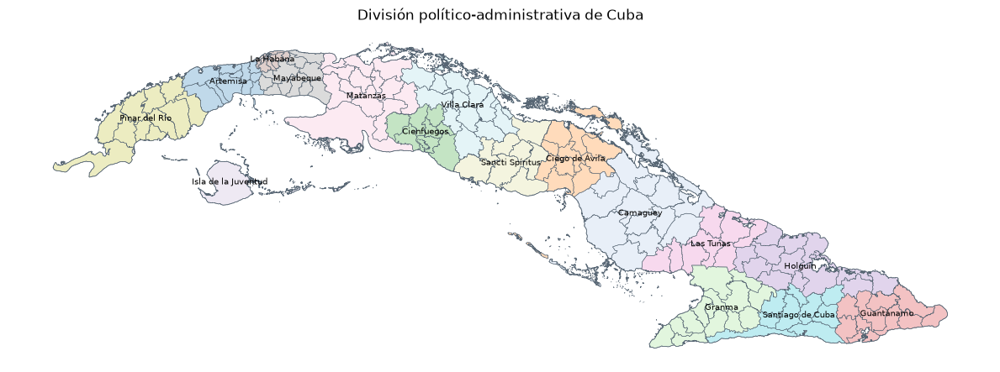

# Cuba Geographic Data

Open geographic datasets for Cuba, compiled from authoritative and openly available sources.

The project provides cleaned and documented geographic data in formats suitable for GIS, spatial analysis, and programmatic use.

## Available data

### Administrative Geographic Names

Official Cuban provinces and municipalities based on the **Código de la División Político-Administrativa (CoDPA)**, with geographic locations and cross-references to external geographic databases.

Available as:

- GeoParquet
- GeoJSON
- GeoPackage

[`data/administrative-geographic-names/`](data/administrative-geographic-names/)

### Administrative Geometry

Administrative geometry for Cuban provinces and Isla de la Juventud, based on CoDPA administrative units and compiled from open geographic sources.

Available as:

- GeoParquet
- GeoJSON
- GeoPackage

[`data/administrative-geometry/`](data/administrative-geometry/)

## Examples

The [`examples/`](examples/) directory contains Jupyter notebooks demonstrating how to explore, visualize, and use the published datasets.

## Documentation

- [Data development](docs/data_development.md)
- [References](docs/references.md)
- [Contributing](docs/contributing.md)

## License

Unless otherwise indicated, data in this repository are available under **CC BY 4.0**.

`cuba_administrative_geometry.*` is available under the **Open Database License (ODbL) 1.0**.

See [LICENSE.md](LICENSE.md) for details.

## Support

This is an independent project. If you find it useful and would like to support the work behind it, you can [buy me a coffee](https://buymeacoffee.com/NotTheMapGuy).
